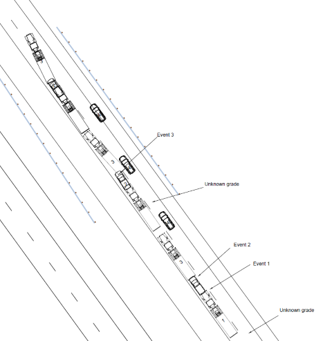

# NHTSA CISS API

Python API to NHTSA Crash Investigation Sampling System (CISS).

## Scene diagram



Given a scene diagram (image above) from [CISS Case Number 1-10-2020-130-01](https://crashviewer.nhtsa.dot.gov/CISS/Details?Study=CISS&CaseId=18892) as `.blz` file:

```python
import matplotlib.pyplot as plt

from nhtsa_ciss_python.scene_diagram import BlitzReader


reader = BlitzReader("tests/20201010130.blz")

# vehicle shapes
vehicles = reader.get_vehicles(only_named=True)

# vehicle IDs, event IDs, human annotations (e.g. 'Event 1')
labels = reader.get_labels()

# lane markings, walls
curves = reader.get_curves()
```

See the [notebook](examples/read_scene_diagram.ipynb) for an example visualization.

## Case overview

TBD
